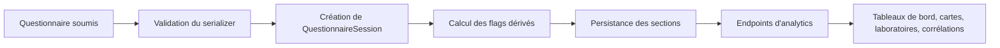

# Rapport technique de la logique de calcul, des laboratoires et du moteur de corrélations

## 1. Objectif du système

La plateforme transforme des questionnaires structurés en indicateurs de santé publique, en analyses par section, en cartes géographiques et en corrélations statistiques. Toutes les métriques principales sont dérivées de données réellement soumises et validées dans la base, via les modèles de session et les sections associées.

## 2. Pipeline de traitement

### Étapes principales

1. Le frontend envoie un payload de questionnaire.
2. Le serializer valide la présence de l’établissement et du gouvernorat.
3. Le backend crée une session principale et les enregistrements de sections associés.
4. Des booléens dérivés sont calculés pour chaque substance et pour le profil de risque global.
5. Les vues d’analytics agrègent ces sessions selon le périmètre utilisateur (national, régional, établissement).

## 3. Modèle de données central

### 3.1 Session principale

La classe centrale est `QuestionnaireSession` dans [api/models.py](api/models.py). Elle contient :

- `school` : établissement scolaire lié à la session.
- `governorate` : gouvernorat lié à la session.
- `school_class` : classe associée, si disponible.
- `class_report` : rapport administratif éventuel.
- `is_valid` : validation de qualité de la soumission.
- `exclusion_reason` : motif d’exclusion si la soumission est rejetée.
- `has_risk_behavior` : indicateur global de risque.
- `tobacco_user`, `ecig_user`, `hookah_user`, `alcohol_user`, `tranquilizer_user`, `cannabis_user`, `cocaine_user`, `ecstasy_user`, `heroin_user`, `inhalant_user` : flags de consommation par substance.
- `extra_answers` : réponses dynamiques supplémentaires.

### 3.2 Sections associées

Chaque section du questionnaire est stockée dans un modèle séparé :

- Section A : profil démographique et contexte familial.
- Sections C à M : consommations de substances.
- Sections N, P : substances de synthèse / NPS.
- Sections Q, R, S, T : perception des risques, réseaux, jeux, argent.
- Sections U, V : violence et stress.
- Section Z : honnêteté et qualité de réponse.

## 4. Validation au moment de la soumission

La validation est faite dans [api/serializers.py](api/serializers.py) par `QuestionnaireSessionSerializer`.

### 4.1 Règles obligatoires

Le serializer exige que chaque questionnaire dispose :

- d’un établissement scolaire valide, ou d’une classe qui pointe vers un établissement, ou d’un rapport de classe lié à un établissement ;
- d’un gouvernorat valide, dérivé de l’établissement, de la classe ou du rapport.

Si l’un de ces composants manque, la soumission est rejetée avec une erreur explicite.

### 4.2 Flags dérivés à la création

Les flags de substance sont calculés à partir des sections concernées. La logique est simple :

- si une section de substance contient une fréquence de vie non nulle (autre que `"1"` ou vide), le flag est mis à `True`.

Exemples :

- `tobacco_user = used(section_c)`
- `alcohol_user = used(section_g)`
- `cannabis_user = used(section_i)`

Le flag global `has_risk_behavior` est défini comme la somme logique de tous ces flags.

### 4.3 Exclusion logique

La soumission est marquée comme invalide si l’une des conditions suivantes est observée :

- genre manquant ou hors des valeurs attendues (`M` ou `F`);
- âge hors limites de la cohorte attendue (ici, environ 15 à 18 ans selon la règle implémentée);
- taux de valeurs manquantes supérieur à 50 % dans les sections transmises;
- réponse positive à la question piège de la section P (consommation fictive).

## 5. Logique de calcul des indicateurs d’analytics

La logique principale est centralisée dans [api/analytics.py](api/analytics.py).

### 5.1 Périmètre d’analyse

`SentinelleAnalytics.get_scoped_sessions(user=None)` applique le périmètre selon le rôle utilisateur :

- `SUPER_ADMIN` / `GLOBAL_ADMIN` : accès national.
- `REGIONAL_ADMIN` : filtrage sur le gouvernorat de l’utilisateur.
- `PRACTITIONER` : filtrage sur l’établissement de l’utilisateur.
- autre rôle : aucun accès.

### 5.2 Prévalence globale

La prévalence de comportement à risque est calculée comme :

$$
\text{prevalence globale} = \frac{\text{nombre de sessions avec has\_risk\_behavior = True}}{\text{nombre total de sessions}} \times 100
$$

### 5.3 Intensity par section (roue radiale)

L’intensité de chaque section de la roue est calculée comme la proportion de sessions qui présentent une caractéristique associée à cette section.

Exemples :

- Section C : proportion de sessions avec `tobacco_user=True`
- Section I : proportion de sessions avec `cannabis_user=True`
- Section U : proportion de sessions avec des bagarres signalées
- Section V : proportion de sessions avec stress élevé

### 5.4 Indicateurs de qualité

La qualité est mesurée à partir :

- du nombre de sessions valides versus invalides ;
- de l’honnêteté déclarée dans la section Z ;
- du taux d’anomalies détectées par le laboratoire.

### 5.5 Démographie et contexte social

Les métriques de base dérivent de la section A et de la section V/U :

- répartition homme/femme ;
- part des élèves selon niveau scolaire / performance ;
- part des élèves avec nuits hors domicile fréquentes ;
- indice de stress PSS-4 basé sur les réponses de la section V ;
- indice de violence basé sur les incidents de bagarre.

## 6. Calculs spécifiques du dashboard

### 6.1 Homepage stats

La méthode `get_homepage_stats()` retourne :

- `headline` : nombre de soumissions, nombre d’établissements, périmètre, description ;
- `kpis` : enquêtes et établissements ;
- `group_prevalence` : cinq groupes de risque (Profil, Social, Addiction, Style de Vie, Conscience) ;
- `section_intensity` : intensité de chaque section pour la roue ;
- `top_sections` : sections actives dans le périmètre ;
- `quality` : nombre de sessions invalides / valides ;
- `global_insights` : démographie, stress, violence, intégrité, comorbidité.

### 6.2 Heat map nationale

`get_national_heat_data()` construit un profil pour chaque gouvernorat. Pour chaque gouvernorat :

- on compte le nombre total de sessions ;
- si une substance est demandée, on calcule le pourcentage de sessions positives pour cette substance ;
- sinon, on utilise `has_risk_behavior` comme proxy de risque général.

La sortie est une structure par gouvernorat avec :

- `submissions`
- `prevalence`
- `active`

## 7. Moteur de corrélations

Le moteur de corrélations est exposé par `CorrelationEngineView` dans [api/views.py](api/views.py).

### 7.1 Principe

Le moteur ne compare pas des “valeurs codées” arbitraires. Il construit des features à partir des réponses réelles et compare :

- un sous-groupe local (périmètre courant : école, gouvernorat ou national) ;
- la référence nationale.

### 7.2 Features utilisées

Les features sont des règles logiques simples, par exemple :

- `violence_initiator` : initiateur de bagarres ;
- `heavy_cannabis` : fréquence élevée de cannabis dans les 12 derniers mois ;
- `daily_tobacco` : tabagisme quotidien ;
- `alcohol_user` : consommation d’alcool ;
- `failing_grades` : performances scolaires faibles ;
- `high_stress` : stress élevé ;
- `social_media_addict` : usage intensif des réseaux ;
- `gaming_addict` : usage intensif des jeux vidéo ;
- `gambling_frequent` : jeux d’argent fréquents ;
- `family_problems` : problèmes familiaux signalés ;
- `vape_daily` : vapotage quotidien ;
- `victim_fights` : victime d’agressions ;
- `nights_out` : sorties nocturnes fréquentes.

### 7.3 Calcul de corrélation

Pour chaque paire de features, le moteur calcule :

$$
\text{rate locale} = \frac{\text{intersection locale}}{\text{cohort local}} \times 100
$$

$$
\text{rate nationale} = \frac{\text{intersection nationale}}{\text{cohort national}} \times 100
$$

$$
\text{deviation} = \text{rate locale} - \text{rate nationale}
$$

Les corrélations finales sont triées par `deviation` puis par `rate`, puis retenues comme les plus pertinentes.

## 8. Laboratoire d’intégrité et d’anomalies

La logique de laboratoire est implémentée dans `get_lab_stats()` dans [api/analytics.py](api/analytics.py).

### 8.1 Objectif

Le laboratoire recherche des incohérences logiques dans les réponses afin d’identifier :

- des déclarations contradictoires ;
- des incohérences chronologiques ;
- des anomalies de fréquence.

### 8.2 Trois couches de vérification

1. Consistance init-prev
   - Un répondant dit ne pas avoir consommé une substance, mais déclare une fréquence non nulle pour cette substance.

2. Temporalité séquentielle
   - L’âge d’usage quotidien est antérieur à l’âge du premier usage, ce qui est biologiquement incohérent.

3. Aberrations de fréquence
   - La fréquence récente (30 jours ou 12 mois) dépasse la fréquence de vie totale.

### 8.3 Indices de confiance

Le laboratoire produit aussi :

- un `trust_index` basé sur l’honnêteté déclarée dans la section Z ;
- un `stress_index` calculé à partir de la section V ;
- un taux de poly-consommation à 2 et à 3 substances ou plus ;
- une liste de combinaisons les plus fréquentes.

## 9. Profil régional

`get_regional_profile()` synthétise un profil détaillé pour un gouvernorat donné. Il fournit :

- répartition par âge et sexe ;
- prévalence des substances ;
- réseau de corrélations entre comportements ;
- stress moyen, violence, honnêteté ;
- conclusions clés extraites des indicateurs observés.

## 10. Points forts de l’architecture actuelle

- Les métriques sont dérivées de données réelles, pas de valeurs codées arbitraires.
- Les permissions sont appliquées au niveau du périmètre utilisateur.
- Les soumissions doivent explicitement être liées à un établissement et à un gouvernorat.
- Les vues d’analytics reposent sur des agrégations explicites et vérifiables.
- Le laboratoire fournit une couche d’audit et de qualité de données.

## 11. Résumé opérationnel

En pratique, la plateforme fonctionne comme un moteur de santé publique appliqué à des questionnaires scolaires :

- elle valide les données à l’entrée ;
- elle calcule des flags de risque et d’intégrité ;
- elle agrège des indicateurs de prévalence et de qualité ;
- elle compare des sous-groupes à la référence nationale ;
- elle produit des tableaux de bord et des analyses de laboratoire exploitables.
